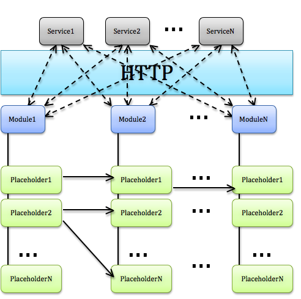

#Catberry Framework Documentation

 

* [Isomorphic Applications](#isomorphic-applications)
* [Introducing Catberry](#introducing-catberry)
* [Service-Module-Placeholder](#service-module-placeholder)
* [Catberry Services](#catberry-services)
	* [Service Locator](#service-locator)
	* [Dependency Injection](#dependency-injection)
	* Userland Catberry Services
		* [Logger](#logger)
        * [Config](#config)
        * [jQuery](#jquery)
        * [Universal HTTP(S) Request](#uhr-universal-https-request)
        * [Dust](#dust)
* [Routing](#routing)
	* [URL Route Definition](#url-route-definition)
	* [Event Route Definition](#event-route-definition)
* [Modules](#modules)
	* [Placeholders](#placeholders)
	* [Render Method](#render-method)
	* [Handle Method](#handle-method)
	* [Submit Method](#submit-method)
	* [Context](#context)
* [Building Browser Bundle](#building-browser-bundle) 
* [Event Bus and Diagnostics](#event-bus-and-diagnostics) 
* [CLI](#cli) 
* [Code Style Guide](code-style-guide.md)

#Isomorphic Applications

Make a long story short, isomorphic applications are built to make it possible 
to write module once and use it for both page rendering on server 
(for SEO and some shared links) and in browser with no server side at all.
It means on server your modules are executing the same code as 
in browser. This [Single Page Application]
(http://en.wikipedia.org/wiki/Single_Page_Application) 
can re-render all parts of the page using the same isomorphic modules and not 
reloading the page at all.

There is an awesome [post in airbnb technical blog]
(http://nerds.airbnb.com/isomorphic-javascript-future-web-apps/) 
about the idea of isomorphic JavaScript applications and what exactly it is.
Also you can find video [Spike Brehm: Building Isomorphic Apps]
(http://www.youtube.com/watch?v=CH6icJbLhlI)
from JSConf 2014 talks.

Isomorphic applications can work with set of independent services that 
implement some business logic (Facebook API, Twitter API, your API etc).
In fact, each module in isomorphic application should receive all data from 
API server which could be written in any platform you want using REST approach.

There is a list of problems which are solved by isomorphic applications:

* *Using single page applications causes SEO problems*. Your isomorphic
modules will render exactly the same page on server as it is in browser
* *Code duplication for rendering parts of the page at server and in browser, 
sometimes it even written in different programming languages*. 
Since isomorphic modules are written only once and in JavaScript 
you do not have this problem.
* *Maintenance is complicated, because you need to synchronize changes 
in server-side and browser modules*. Obviously, you do not need this
using isomorphic modules. It is always one module to change.
* *Overhead connected with rendering all pages on server*. Since browsers 
receive a page from server only once and then render all other pages in 
their browsers your server's load will be reduced dramatically.
 
And maybe a lot of more, who knows.

Technologies like History API and node.js make this type 
of applications possible and we should use this possibility.  

#Introducing Catberry

Catberry is a framework for [Isomorphic Applications]
(#isomorphic-applications). Also it is a [connect]
(https://github.com/senchalabs/connect)/[express]
(https://github.com/visionmedia/express) middleware.

It makes possible to write modules that on the one hand will be used for 
rendering at the server side for SEO purposes and shared links, 
and on the other hand for rendering in browser for [Single Page Application]
(http://en.wikipedia.org/wiki/Single_Page_Application).

A lot of features are also described in [read me](../README.md) file and 
there is a list of most important advantages which your isomorphic application 
receives using Catberry:

* Server-side rendering is stream-based, it means user will see a page
immediately and do not need to wait until all API requests will be finished
* Application consists of independent modules. Page consists of placeholders and 
each module controls a group of such placeholders. 
Make and combine placeholders in modules as you want
* Every placeholder is a [dustjs](https://github.com/linkedin/dustjs) template 
with all advantages of this streaming template engine 
* Routing engine supports parsing of parameters from URLs and map it 
to state object in the module. URL and state are automatically synchronized 
in browser and at server as well
* Caching data that was rendered in placeholders
* Every module can set cookies, do HTTP(S) requests, redirect to another 
location in the same way as at server as in browser
* Every module can handle link clicks and hash changes with passing arguments 
in a very simple way
* Every module can receive submitted form and, for example, pass its data to API
* Whole module API is built using [promises](https://www.promisejs.org/). 
Promise is a main approach for working with asynchronous operations in Catberry
application.

#Service-Module-Placeholder

Catberry proposes to use [Service-Oriented Architecture]
(http://en.wikipedia.org/wiki/Service-Oriented_Architecture) where every module 
can work with set of independent services (or one service) that implement 
some business logic.

So, Catberry Application consist of:

 * Set of services (that implements business logic or uses third-party APIs)
 * Set of modules (more details in [Modules section](#modules))
 * Set of placeholders (templates) that can reference each other 
 (more details in [Placeholders section](#placeholders))

Typical architecture in common case is presented in image below:



You can find example application
[here](https://github.com/catberry/catberry-cli/tree/master/templates/example)
with architecture that is described below:


This approach allows your module to be executed at server and in browser as well 
without any additional logic written by you. All you need is to use 
[Universal HTTP(S) Request](#uhr-universal-https-request) - 
this component implements HTTP(S) request logic using `XmlHttpRequest` 
in browser and `http.request` at server and has the same interface.

#Catberry Services

In Catberry all framework components such as Logger or 
Universal HTTP(S) Request are called as services. 

Whole Catberry architecture is built using [Service Locator]
(http://en.wikipedia.org/wiki/Service_locator_pattern) pattern and 
[Dependency Injection](http://en.wikipedia.org/wiki/Dependency_injection).
Service Locator is a Catberry core component that knows every other Catberry 
component. All these components can ask Service Locator to get instance
of some other component. For example, every component and even userland 
catberry module can ask for a Logger to log messages to console.

When Catberry initializes itself it fills Service Locator with own set of
components, but framework users can also register own components and even
replace implementation of some Catberry components. For example, you can replace
Logger service in Locator with your own logger which sends messages 
to Graylog (or any other).
 
To register your own components you should keep in mind that 
you probably need different implementations of your component for server and browser 
if it depends on the environment.

Learn more how to use Service Locator in next section.

##Service Locator

Whole architecture of Catberry framework is based on 
[Service Locator pattern](http://en.wikipedia.org/wiki/Service_locator_pattern) 
and [Dependency Injection](http://en.wikipedia.org/wiki/Dependency_injection).

###Register Own Services
There is only one service locator (singleton) in one catberry application 
instance and all Catberry's components are resolved from this locator when 
you use `getMiddleware` method on server or `startWhenReady` in browser code.
Before that, feel free to register your own services to inject it into 
catberry modules via DI.

Your Catberry application must have `./server.js` with code like this:
```javascript
var catberry = require('catberry'),
	RestApiClient = require('./lib/RestApiClient'),
	connect = require('connect'),
	config = require('./server-config'),
	cat = catberry.create(config),
	app = connect();

// when you have created instance of Catberry application
// you can register in Service Locator everything you want.
cat.locator.register('restApiClient', RestApiClient, config, true);

// you can register services only before this method cat.getMiddleware()
app.use(cat.getMiddleware());
app.use(connect.errorHandler());
http
	.createServer(app)
	.listen(config.server.port || 3000);

```

And `./browser.js` with code like this:
```javascript
var RestApiClient = require('./lib/RestApiClient'),
// create catberry application instance.
	catberry = require('catberry'),
	config = require('./browser-config'),
	cat = catberry.create(config);

// then you could register your components to inject into catberry modules.
cat.locator.register('restApiClient', RestApiClient, config, true);

// you can register services only before this method cat.startWhenReady()
// tell catberry to start when HTML document will be ready
cat.startWhenReady(); // returns promise

```

Also you can override some existing registrations, for example Logger:
 
```javascript
cat.locator.register('logger', MyCoolLogger, config, true);
```

It registers one more implementation of logger. Catberry always uses last
registered implementation of every service.

You can also get access to all implementations using `resolveAll` method.

How to use registered service please read 
in [Dependency Injection](#dependency-injection) section.

###Interface

Catberry's Service Locator implementation has following methods:

```javascript
/**
 * Registers new type in service locator.
 * @param {string} type Type name, which will be an alias in other constructors.
 * @param {Function} constructor Constructor which
 * initializes instance of specified type.
 * @param {Object?} parameters Set of named parameters
 * which will be also injected.
 * @param {boolean?} isSingleton If true every resolve will return
 * the same instance.
 */
ServiceLocator.prototype.register = function (type, constructor, parameters, isSingleton){ }

/**
 * Registers single instance for specified type.
 * @param {string} type Type name.
 * @param {Object} instance Instance to register.
 */
ServiceLocator.prototype.registerInstance = function (type, instance) { }

/**
 * Resolves last registered implementation by type name
 * including all its dependencies recursively.
 * @param {string} type Type name.
 * @returns {Object} Instance of specified type.
 */
ServiceLocator.prototype.resolve = function (type) { }

/**
 * Resolves all registered implementations by type name
 * including all dependencies recursively.
 * @param {string} type Type name.
 * @returns {Array} Array of instances specified type.
 */
ServiceLocator.prototype.resolveAll = function (type) { }

/**
 * Resolves instance of specified constructor including dependencies.
 * @param {Function} constructor Constructor for instance creation.
 * @param {Object?} parameters Set of its parameters values.
 * @returns {Object} Instance of specified constructor.
 */
ServiceLocator.prototype.resolveInstance = function (constructor, parameters) { }

/**
 * Unregisters all registrations of specified type.
 * @param {string} type Type name.
 */
ServiceLocator.prototype.unregister = function (type) { }
```

##Dependency Injection

If you need to use your own or Catberry's service registered in Service Locator
you just should inject it in module of your application.

For example, you have module called AwesomeModule. In Catberry every module is 
a constructor with prototype. To inject Logger, your own RestApiClient and 
someConfigKey from config object you just need to specify such constructor in 
your module:

```javascript
function AwesomeModule($logger, $restApiClient, someConfigKey) {
	// here logger and restApiClient are instances will be accessible
	// via dependency injection from service locator
	// someConfigKey will be accessible from startup config object
	// via dependency injection too
}
```

In release mode this code will be optimized (minified) for browser, 
but all these injections will stay as is and will not be broken.

Also you can inject only `$serviceLocator` and resolve everything you want
directly.

It is really important not to make loops in resolving dependencies. It causes
infinite recursion and just kill your application.

Read also:

Userland Services

* [Logger](#logger)
* [Config](#config)
* [jQuery](#jquery)
* [Universal HTTP(S) Request](#uhr-universal-https-request)
* [Dust](#dust)

##Logger

Catberry has an universal logger service registered as "logger" in 
[Service Locator](#service-locator) and accessible via 
[dependency injection](#dependency-injection).

Just inject `$logger` into your module or resolve it from 
Service Locator to use this service.

This logger implementation has standard for all loggers methods 
{trace, warn, info, error, fatal}. 
Last two supports Error object to be passed as an argument.

Actually when you use this service at server it uses 
[log4js](https://www.npmjs.org/package/log4js) module inside. 
It means you can configure it as described [here]
(https://github.com/nomiddlename/log4js-node) in its README file.

In browser it is implemented as a very simple logger that can only write 
to browser's console.

###Configuration
To configure browser logger you should just set parameter object `logger` in 
Catberry config object.

Like this for browser logger:
```json
{
	"logger": {
		"levels": "warn,error"
	}
}
```

To configure server logger you have to do more actions:
```javascript
var log4js = require('log4js'); 
//console log is loaded by default, so you won't normally need to do this
//log4js.loadAppender('console');
log4js.loadAppender('file');
//log4js.addAppender(log4js.appenders.console());
log4js.addAppender(log4js.appenders.file('logs/cheese.log'), 'cheese');

var logger = cat.locator.resolve('logger');
logger.setLevel('ERROR');
```

More details [here](https://github.com/nomiddlename/log4js-node#usage).

###Interface

* Browser: [./browser/Logger.js](../../../browser/Logger.js)
* Server: [log4js](https://www.npmjs.org/package/log4js)

##Config

Catberry has a config service registered as "config" in 
[Service Locator](#service-locator) and accessible via 
[dependency injection](#dependency-injection).

Just inject `$config` into your module or resolve it from 
Service Locator to use this service.

This service is just a full config file which was passed to `catberry.create()`
method.

##jQuery

Catberry has jQuery service registered as "jQuery" in 
[Service Locator](#service-locator) and accessible via 
[dependency injection](#dependency-injection).

Just inject `$jQuery` into your module or resolve it from 
Service Locator to use this service.

This popular library is used for DOM manipulation in Catberry's browser modules.
But it also can be used in your own modules.

All details about usage you can read in jQuery official documentation [here]
(http://api.jquery.com).

Please keep in mind that you can resolve jQuery at server and in browser,
but actually it can be used only in browser where `window` object is defined.

##UHR (Universal HTTP(S) Request)

Catberry has Universal HTTP(S) Request service registered as "uhr" in 
[Service Locator](#service-locator) and accessible via 
[dependency injection](#dependency-injection).

All details about usage you can read in UHR read me file [here]
(https://github.com/catberry/catberry-uhr/blob/master/README.md).

##Dust

Catberry has dustjs template engine service registered as "dust" in 
[Service Locator](#service-locator) and accessible via 
[dependency injection](#dependency-injection).

Just inject `$dust` into your module or resolve it from 
Service Locator to use this service.

Catberry uses [dustjs](https://github.com/linkedin/dustjs) template engine
for placeholder rendering and if you need to add some 
[filters](https://github.com/linkedin/dustjs/wiki/Dust-Tutorial#more-on-dust-output-and-dust-filters) 
or [helpers](https://github.com/linkedin/dustjs/wiki/Dust-Tutorial#writing-a-dust-helper) 
in it you can inject it to main module and do everything you need.

#Routing

Catberry has two routing subsystems:

* URL routing system: routes all URL changes and map URL arguments 
to states of modules. All rules must be defined in `./routes.js`
* Event routing system: routes all page hash changes or `data-event` 
attributes of links in page. Invokes handle methods of all modules-receivers. 
All rules must be defined in `./events.js`.

If your application does not have routing rules, your modules can not render
page blocks and handle any events from page.

All details about definition of route rules are described in next sections.

##URL Route Definition

Catberry requires route definitions in `./routes.js`.

Route definition is a rule that describes which URLs are handled by Catberry,
what parameters Catberry can parse from these URLs and what modules will 
receive parsed parameters.
 
### Colon-marked parameters definition

Default definition syntax is following:

```
/some/:id[module1,module2]/actions?someParameter=:parameter[module1]
```

All parameters must be marked with colon at start and followed by list of 
module names that will receive value of this parameter to its state object.

In previous example `id` value will be set to state of modules 
`module1`, `module2`; and `parameter` value will be set only to state of module
`module1`.

Please keep in mind that parameter **name** in route definition should satisfy
regular expression `[$A-Z_][\dA-Z_$]*` and parameter **value** should satisfy
regular expression `[^\/\\&\?=]*`.

### Colon-marked parameters with additional `map` function

Also you can define mapper object, that allows you to modify state object before 
it will be processed by modules.

For such definition just use object like this:

```javascript
{
	expression: '/user/news/:category[news]',
	map: function(state) {
		state.news.pageType = 'userNews';
		return state;
	}
}

```
Map function receives state prepared by expression rule. State is an object 
where keys are names of receiver modules and values are state objects for every 
module receiver. You can change whole state object if you want and return it
from map function.

In this example module `news` will receive additional state parameter `pageType`
with value `userNews`.

### Regular expression
For some rare cases you may need to parse parameters by yourself using regular
expressions. In these cases you can define mapper object as listed below:

```javascript
{
	expression: /^\/orders\/\d+/i,
	map: function(urlPath) {
		var matches = urlPath.match(/^\/orders\/(\d+)/i);
		return {
			order:{
				orderId: Number(matches[1])
			}
		};
	}
}
```

In this example module `order` will receive parameter `orderId` with value
matched with number in URL.

### File example
Here is example of `./routes.js` file with all 3 cases of route definition:

```javascript
module.exports = [
	'/user/:id[user,menu,notifications]',
	{
		expression: '/user/news/:category[news]',
		map: function(state) {
			state.news.pageType = 'userNews';
			return state;
		}
	},
	{
		expression: /^\/orders\/\d+/i,
		map: function(urlPath) {
			var matches = urlPath.match(/^\/orders\/(\d+)/i);
			return {
				orderId: Number(matches[1])
			};
		}
	}
];
```
##Event Route Definition

Catberry supports optional event route definitions in `./events.js`.

Event route definitions describe which events are handled by Catberry, 
what parameters Catberry can parse from event names and what modules will
receive event and parsed parameters.

Event could be raised in two cases:

* Changed hash in location (if you has clicked in page on link that contains 
hash in `href` attribute or if you open shared link with hash), 
in this case hash is an event string. 
Sample link element: `<a href="#event-name">Title</a>`.
Sample url: `http://yourserver.com#event-name`.
* Click on link or button (`<a>` or `<button>` element) with `data-event` 
attribute, which value is event string. Use this case if you don't want to update 
location hash. `href` attribute of link element in this will be ignored.
Sample link element: `<a href="#event-name" data-event="event-name">Title</a>`.
Sample button element: `<button data-event="event-name">Details</button>`.

When you change hash in location, modules receive two events:

* Previous event was ended (last hash is cleared)
* New event is starting (new hash is set)

When you click on link or button with `data-event` it is always "start" an 
event and never "end" of event.

###Definition or rules

There is one way to define event routing rule:

```
expressionWithParameters->eventName[module1, module2, module3]
```

`expressionWithParameters` - this is expression with colon-marked parameters
which is very similar with [URL Route Definition](#url-route-definition) but
without list of modules receivers in it.
Before `->` it is **event string format** that can contain any parameters.
Then after `->` you should define **event name** that will be raised in module and
list of modules that will receive this event.

### Example of definition
For example, we have rule 
```
limit:count->limit[feed]
```
If this rule is defined and event or hash is `limit50` then `feed` module's 
`handle` method will be invoked with event string `limit50`, event name `limit`
 and arguments: 
```json
{
  "count": "50"
}
```

More complex example:
```
removeComment-:id-:someOther->removeComment[comments, feed, rating]
```

Let's say hash is `#removeComment-1-text`.

Modules `comments`, `feed` and `rating` will handle event with name 
`removeComment` and arguments:
```json
{
  "id": "1",
  "someOther": "text"
}
```

Please keep in mind that parameter names should satisfy regular expression
`[$A-Z_][\dA-Z_$]*` and parameter values should satisfy regular expression
`\w*`.

### File example
Here is an example of `./events.js` file with some event route definitions:

```javascript
module.exports = [
	'forget-password->forget-password[auth]',
	'limit:number->limit[orderComments]',
	'remove-:entityType-:id->remove[main]'
];
```

#Modules

Modules are building blocks of web-application using Catberry framework.
Usually modules are placed in `./catberry_modules` directory. Or you can override it
if set `modulesFolder` parameter in Catberry config.

The main approach in Catberry for controlling asynchronous operations is 
[Promise](https://www.promisejs.org/). Catberry uses native `Promise` in browser 
or in node.js (V8) if it is possible but if `Promise` is not found in global 
scope it will be defined using 
["Bare bones Promises/A+ implementation"](https://www.npmjs.org/package/promise).
It means you can use `Promise` type globally and do not worry about its support.

###How to add modules
There are some rules how to add modules to your application:

* It always should be module `main` and its placeholder `__index.dust` with
template of whole application page (html, head, body etc)
* In fact every module is a directory, name of directory is a name of module
* Module can optionally have a logic (can just has templates), if so 
it should have `index.js` that exports module constructor
* Module can optionally have placeholders, if so it should have `placeholders`
directory inside with [dustjs](https://github.com/linkedin/dustjs) templates.
Placeholders can be placed in sub-directories but with unique names

Please keep in mind that module name (directory name) should satisfy regular 
expression `^[a-z]+[a-z0-9-]*$`.

###Module context
Every module instance always has `$context` property which is assigned by
Catberry when module initializes. Catberry updates `$context` every time when the 
state of application is changed. 

At server Catberry creates new instance of module for every incoming 
request (but call constructor only once) therefore `$context` object is different
for every incoming HTTP request and represents URL parameters.

In browser Catberry creates module once and create `$context` at the same time.
Then just update state of `$context` every time user clicks link with URLs
inside the application.

###Example of application structure
Typically directory structure of your application should look like this:
```
catberry_modules/
	main/
		placeholders/
			__index.dust # root placeholder (page template)
			__error.dust # error placeholder to replace errors in release mode
			placeholder1.dust
			placeholder2.dust
			...
			placeholderN.dust
		MainModule # main module implementation
		index.js # just module.exports = require('./MainModule');
	module1/
		placeholders/
			__error.dust # error placeholder to replace errors in release mode
			placeholder1.dust
			placeholder2.dust
			...
			placeholderN.dust
		ModuleConstructor # module implementation
		index.js # just module.exports = require('./ModuleConstructor');
	...
	moduleN/
lib/ # directory for your own external non-catberry components/services
public/ # this directory is default destination for browser bundle building
browser.js # browser initial script
server.js # connect server start script
routes.js # definition of URL route definitions
events.js # definition of event route definitions
```

###Module code watch and reload
By default Catberry works in debug mode and it means that all changes in code
of your modules will automatically reload modules in runtime. You can switch it 
to release mode passing `isRelease: true` parameter in config of Catberry 
application like this:

```javascript
var catberry = require('catberry'),
cat = catberry.create({isRelease: true}),
```

If you want to see finished application as an example then please proceed to 
[example directory](https://github.com/catberry/catberry-cli/tree/master/templates/example).

##Placeholders

Placeholder is a block of page that is controlled by a module. In fact every
placeholder is a template that is stored in module's `placeholders` directory 
and rendered in any position on page.

Catberry uses [dustjs](https://github.com/linkedin/dustjs) template engine.
All stuff about how to use and what syntax it has you can read [here]
(https://github.com/linkedin/dustjs/wiki/Dust-Tutorial). Also [dustjs-helpers]
(https://github.com/linkedin/dustjs-helpers) are included in Catberry.

Placeholder is named by its filename, for example, if file is called `some.dust`
then placeholder name is `some`. But in some cases you will need a full name. 
It means if you have module `cat` and its placeholder `paw` then 
full name of placeholder will be `cat_paw`.
 
Please keep in mind that placeholder name should satisfy regular expression
`^[\w-]+$`.

###How do I decide what part of page should be a placeholder?
There are two simple rules that helps with this decision:

* If you can prepare whole data context for some part of page using one request 
to API service that means this part of page could be a placeholder
* If you want to refresh some group of placeholders simultaneously using 
shared parameters from URL then you should group these placeholders into 
one module

For example, you have some parts of page that dependents on current ID of 
product in URL. There is a part of page that displays product details, 
another one displays comments of users about this product and some side block 
that shows "similar product". All these three parts of page are placeholders.
And as well it all depends on one shared parameter `productId`. It means that
placeholders should be grouped into one module `product`.

###Placeholder types
There are two reserved names of placeholders:

* `__index` - is used as whole page template in `main` module and 
is called "root placeholder"
* `__error` - is used to show user-friendly error messages in blocks that has 
errors during rendering. It is called "error placeholder"

###Placeholder references
All placeholders can have references to other placeholders and when rendering
engine starts to render some placeholder and meet such reference it render
referenced placeholder and recursively repeat this process. 
But every placeholder can be rendered only once, second time it will just be
skipped.

The reference itself is any HTML element with ID equals full name 
of placeholder. For example you have two modules: `cat` and `planet`. 
`planet` has placeholder `house` and `cat` has placeholder `black-cat`.

Also you always must have `main` module with placeholder `__index`.
So, let's say you have such `__index`:

```html
<!DOCTYPE html>
<html>
<head lang="en">
    <meta charset="UTF-8">
    <title>Cat planet</title>
</head>
<body>
	<div id="planet_house"></div>
</body>
</html>
```

And placeholder `house` of `planet` is:
```html
Big house here... Wait... It's a cat!
<div id="cat_black-cat"></div>
```

Also `cat` module has such `black-cat` placeholder:
```html
<h1>Meow, my planet friends</h1>!
```

As a result of rendering will be:

```html
<!DOCTYPE html>
<html>
<head lang="en">
    <meta charset="UTF-8">
    <title>Cat planet</title>
</head>
<body>
	<div id="planet_house">
		Big house here... Wait... It's a cat!
		<div id="cat_black-cat">
			<h1>Meow, my planet friends</h1>!
		</div>
	</div>
</body>
</html>
```

All placeholder references just were replaced with rendered templates with data
from modules.

In some situations you need to render some part of HTML that often repeats
in your markup but do not have some complex logic for creation of data context.
In this case it is really handy to use [dustjs partials]
(https://github.com/linkedin/dustjs/wiki/Dust-Tutorial#partials) 
not placeholders.
 
###Streaming
At server whole page is rendered using stream. In many frameworks (like express)
rendering is happened in-memory and after whole page is prepared 
it is sent to browser.

Catberry works different. When rendering process is just started it already 
starts to send data to browser and user already sees a page. 
For user this experience looks like very fast and smooth rendering process and 
the initial delay for response is minimal.

When you make request to your API service for every placeholder on page it can
be slowly for rendering whole page, but using streams it looks like "blazing
fast", because user already sees page before any request to API service and each 
placeholder is rendered in browser immediately after response from your API 
service.

That is why Catberry has so fast rendering engine.

###Concurrent rendering
In browser rendering works differently. Rendering engine observes state of
every module and if it is changed all placeholders of changed modules are 
rendering again. During rendering in browser all API requests are doing 
concurrently for all placeholder references that makes rendering process fast.

###Scroll top
By default Catberry tries to save current scroll position when rendering 
in browser but in some situation you may need to scroll top of page when change
content of page. In this case you can add `data-scroll-top` attribute to your
placeholder`s HTML element. After such placeholder was rendered page will be 
scrolled top.

###Loading class
Every time when placeholder is waiting for data from module's `render` method
it receives `loading` CSS class. It means you can customize loading state as 
you want.

###HEAD element as a placeholder
`<head>` element also can be a placeholder. You can change `<title>`, `<meta>`,
add new `<script>` or `<link>` elements dynamically. At server `<head>` 
placeholder is rendered as usually, but in browser `<head>` rendering is 
not simple for Catberry but is simple for you. When your module changes 
content of `<head>` placeholder, rendering engine merges all changes with 
current `<head>` and do not load styles and scripts one more time.

So, what is happened during this merge:

* Catberry compares current and new `<head>` representation
* If current `<head>` has elements that are absent in new `<head>` then all 
these elements are removed from `<head>` except scripts and styles
* Then Catberry takes elements from new `<head>` that are absent in current 
`<head>` and adds it to end of current `<head>`

This approach makes `<head>` changes smoothly for user and do not execute 
JavaScript code, included in head, twice.

##Render method
Every module can have `render` method like this:
```javascript
Module.prototype.render = function (placeholderName) {
	return {}; // some data context or promise for it 
};
```

Or like this:
```javascript
Module.prototype.renderPlaceholderName = function () {
	return {}; // some data context or promise for it 
};
```

For example, you have a placeholder with name `some-awesome-placeholder` and 
owner of this placeholder is module `big-paw`.
When rendering engine finds placeholder reference like 
`<div id="big-paw_some-awesome-placeholder"></div>` it tries to invoke such 
methods by priorities:

* `BigPaw.renderSomeAwesomePlaceholder()`
* `BigPaw.render('some-awesome-placeholder')`
* `function() { return Promise.resolve(); }`

As you may notice Catberry converts name of placeholder to camel case and 
build name or `render` method automatically.

Every render method should return an object as data context or Promise for it. 
`undefined` is also a proper value, it means render method can return nothing.

In browser render method is also called when module state is changed and 
need to refresh all module's placeholders.

After `render` method is successfully finished `after` method is called. For
previous example it is (by priorities):

* `BigPaw.afterRenderSomeAwesomePlaceholder()`
* `BigPaw.afterRender('some-awesome-placeholder')`
* `function() { return Promise.resolve(); }`

The main thing you should keep in mind is that method `render` is executing at
server and in browser as well. It means you can not use environment-specified
JavaScript using `window` or `process`, for example. If you need to do redirect, 
set cookie or clear hash in URL you can use 
[Module Context methods](#context).

`after` method is called only in browser, feel free to use browser 
environment in it. The main task that is solved by `after` method is working 
with DOM after placeholder is rendered. Maybe you need to wrap some elements
with logic or subscribe on some events and so on.

If you have an error during render method `Error` object should be passed 
to callback as first argument. Passed error causes stack trace print instead 
placeholder template in debug mode or `__error` placeholder rendering in 
release mode (or nothing if `_error` does not exist).

By default rendering works in debug mode, to switch it to release mode,
please pass `isRelease: true` parameter in config of Catberry application like
this:

```javascript
var catberry = require('catberry'),
	cat = catberry.create({isRelease: true}),
```

##Handle method
Every module can have `handle` method like this:
```javascript
Module.prototype.handle = function (eventName, event) {
	return Promise.resolve(); // return Promise or nothing 
};
```

Or like this:
```javascript
Module.prototype.handleEventName = function (event) {
	return Promise.resolve(); // return Promise or return nothing 
};
```

This method is used to handle events specified in [Event Route Definition]
(#event-route-definition). 

For example, you have an event with name `some-awesome-event` and 
this event should be handled in module `big-paw` then `./event.js` has 
such string:
```
some-awesome-event->some-awesome-event[big-paw]
```

When event is happened on page Catberry tries to invoke such methods 
by priorities:

* `BigPaw.handleSomeAwesomeEvent(event)`
* `BigPaw.handle('some-awesome-event', event)`
* `function() { return Promise.resolve(); }`

As you may notice Catberry converts name of event to camel case and 
build name or `handle` method automatically.

The main thing you should keep in mind is that method `handle` is executing only
in browser. It means you can not use server environment-specified
JavaScript, `process` object for example.

###Event object

For example event definition is:
```
remove-:type-:id->remove[entity-manager]
```

And we click on `button` with `data-event="remove-comment-42"`. 

In this case such event object will be passed to handle method of module 
`entity-manager`:
```javascript
{
	string: 'remove-comment-42', // the same is in data-event attribute  
	isEnding: false, // if we clear or change hash this value is true
	isHashChanging: false, // we just push button and did not change hash 
	element: $(), // button element wrapped by jQuery
	eventName: 'remove',
	args: {
		type: 'comment',
		id: '42'
	}
}
```

###Two event types
There are two different types of events:

* Moment events: happened only with `isEnding = false` and the source of event 
is click on link or button with attribute `data-event`.
* Continuous event: happened with `isEnding = false` when it starts and 
`isEnding = true` when it ends and always has `isHashChanging = true`. 
Such events are happened when hash in location is changed to event expression 
routed by [Event Route Definition](#event-route-definition).

Name of event, arguments are also defined by [Event Route Definition]
(#event-route-definition).

##Submit method
Every module can have `submit` method like this:
```javascript
Module.prototype.submit = function (formName, event) {
	return Promise.resolve(); // promise or nothing 
};
```

Or like this:
```javascript
Module.prototype.submitFormName = function (event) {
	return Promise.resolve(); // promise or nothing 
};
```

This method is used to process submitted forms from page. Every form submit 
routes serialized form to module-receiver.

For example you have such form:
```html
<form name="paw-size" data-module="cat" data-dependents="cat_paw&cat_body">
    Enter paw size for cat:<br/>
    <input name="size" type="text"><br/>
    <input type="submit" value="Let's see the paw!">
</form>
```

You enter a paw size and click submit and Catberry tries to invoke such 
methods by priorities:

* `Cat.submitPawSize(event)`
* `Cat.submit('paw-size', event)`
* `function() { return Promise.resolve(); }`

As you may notice Catberry converts name of event to camel case and 
build name or `submit` method automatically.

The main thing you should keep in mind is that method `submit` is executing only
in browser. It means you can not use server environment-specified
JavaScript, `process` object for example.

Required attributes for form element to send this form to module are following:

* `name` - form should have a name
* `data-module` - name of module receiver

Also you can specify full names of placeholders that should be refreshed after
form will be submitted to module. Use `data-dependents` attribute for that and
enumerate placeholder full names with `&` separator.

###Event object
For previous example `event` argument in submit method will be object like this:
```javascript
{
	element: $(), // form element wrapped by jQuery 
	name: 'paw-size', // the same as name attribute value in form element
	moduleName: 'cat', // the same as data-module attribute value
	values: { // all values from form inputs
		size: 'some text was typed in size field'
	}
}
```

##Context

Every module always has a context. Even when module constructor is called 
module already has an initial context with empty state.

Context is an object with methods and data that dependents on current 
application state. You can use context everywhere: at server or in browser, in
constructor or in any methods of module. All context methods are 
environment-independent and have different implementations for 
server and browser but module developer should not worry about it, usage of 
context is always safe.

You can access context via `$context` property of your module object. It is
assigned by Catberry on module initialization and then refreshed (re-assigned) 
every time when application state is changing.

###Environment flags
For some situations you maybe have to determine where current code is executing.
There are two flags in context for this purpose: `isBrowser` and `isServer`. 
Both flags are read-only properties.

###Current URL path
If you want to determine what is the current URL path then you can use `urlPath` 
property. This value is a concatenation of `location.pathname` and 
`location.search` in browser and `request.url` at server.

###Referrer
If you want to know previous browser's page URL you can use `referrer` property. 
But use it carefully because at server Catberry uses `Referer` HTTP header 
and in browser it is just previous URL in History API.

###User agent
You can get user agent string whenever you want using `userAgent` property
of context.

###State
The most important thing in context is a `state` property. It is an immutable 
object that you can use to know what application parameters are now. 
All these parameters are specified by 
[URL Route Definition](#url-route-definition). It is main source 
of input data for rendering and is often used in module [`render` methods]
(#render-method).

Keep in mind that state object is immutable and every time 
when state is changing it is just re-assigned to context 
therefore it is highly not recommended to save state into variable, 
it can cause unexpected behaviour and memory leaks.

###Rendered data cache
Context also has a set of data contexts that were rendered on page in property
`renderedData`. It can be used to re-use data of other placeholders when 
[`render` method](#render-method) is working.

It always has last rendered data context for every rendered placeholders. Object
has a structure described below:

```javascript
{
	module1:{
		placeholder1: {
			someData: 'data'
		},
		placeholder2: {
			someData: 'data'
		},
		placeholderN: {
			someData: 'data'
		}
	},
	moduleN:{
		placeholder1: {
			someData: 'data'
		},
		placeholder2: {
			someData: 'data'
		},
		placeholderN: {
			someData: 'data'
		}
	}
}
```

###Cookies
Next property of context is `cookies`. It is an universal wrapper that can `get`
and `set` cookies in environment-independent way.

It has following interface:

```javascript
/**
 * Gets cookie value by name.
 * @param {string} name Cookie name.
 * @returns {Object}
 */
CookiesWrapper.prototype.get = function (name) { }

/**
 * Sets cookie to this wrapper.
 * @param {Object} cookieSetup Cookie setup object.
 * @param {string} cookieSetup.key Cookie key.
 * @param {string} cookieSetup.value Cookie value.
 * @param {number?} cookieSetup.maxAge Max cookie age in seconds.
 * @param {Date?} cookieSetup.expire Expire date.
 * @param {string?} cookieSetup.path URL path for cookie.
 * @param {string?} cookieSetup.domain Cookie domain.
 * @param {boolean?} cookieSetup.secure Is cookie secured.
 * @param {boolean?} cookieSetup.httpOnly Is cookie HTTP only.
 * @returns {string} Cookie setup string.
 */
CookiesWrapper.prototype.set = function (cookieSetup) { }
```

###Methods
Also context has a lot of useful methods:

```javascript
/**
 * Redirects current page to specified URL.
 * @param {string} locationUrl URL to direct.
 * @returns {Promise} Promise for nothing.
 */
ModuleApiProvider.prototype.redirect = function (locationUrl) {};

/**
 * Clears current location's hash.
 * @returns {Promise} Promise for nothing.
 */
ModuleApiProvider.prototype.clearHash = function () {};

/**
 * Requests refresh of module's placeholder.
 * Refresh also re-handles current hash event.
 * @param {string} moduleName Name of module to render.
 * @param {string} placeholderName Name of placeholder to refresh.
 * @returns {Promise} Promise for nothing.
 */
ModuleApiProvider.prototype.requestRefresh = function (moduleName, placeholderName) {};

/**
 * Requests render of module's placeholder.
 * @param {string} moduleName Name of module to render.
 * @param {string} placeholderName Name of placeholder to refresh.
 * @returns {Promise} Promise for nothing.
 */
ModuleApiProvider.prototype.requestRender = function (moduleName, placeholderName) {};

/**
 * Renders specified template with data.
 * @param {string} moduleName Name of module, template owner.
 * @param {string} templateName Name of template.
 * @param {Object} data Data context for template.
 * @returns {Promise<string>} Promise for rendered template.
 */
ModuleApiProvider.prototype.render = function (moduleName, templateName, data) {};

/**
 * Subscribes on specified event in Catberry to handle once.
 * @param {string} eventName Name of event.
 * @param {Function} handler Event handler.
 * @returns {ModuleApiProviderBase} This object for chaining.
 */
ModuleApiProviderBase.prototype.once = function (eventName, handler) {};

/**
 * Removes specified handler from specified event.
 * @param {string} eventName Name of event.
 * @param {Function} handler Event handler.
 * @returns {ModuleApiProviderBase} This object for chaining.
 */
ModuleApiProviderBase.prototype.removeListener = function (eventName, handler) {};

/**
 * Removes all handlers from specified event in Catberry.
 * @param {string} eventName Name of event.
 * @returns {ModuleApiProviderBase} This object for chaining.
 */
ModuleApiProviderBase.prototype.removeAllListeners = function (eventName) {};
```

###Rendering on demand
You can update any placeholder at any time using `requestRender` or 
`requestRefresh` (the same but re-invokes hash event). 

If you need to render placeholder or partial template
dynamically, maybe for lazy loading or anything else, you can render template
manually and skip usage of Catberry rendering system.
For this purpose just use `render` method in context object.

Keep in mind that you can use render on demand only in browser therefore at
server these methods do nothing.

###How does redirect, clearing hash and cookies manipulating work?
Since Catberry uses streaming engine to render page, it can not use HTTP headers
for setting cookies or redirecting pages. It uses rendering of inline 
`<script class="catberry-inline-script">` elements to execute required 
JavaScript to set cookies, redirect or clear hash in location.

If you use such methods as `redirect`, `cookies.set` or `clearHash` in main 
module rendering `__index` placeholder then `<script>` element will be placed in
`<head>` element of page. Otherwise it will be rendered at the beginning of
placeholder content.

After code is executed, `<script>` elements will be removed by Catberry 
initialization.

Although `<script>` element are removed after executing it is still not save to
set some cookies that should be 100% secured. It is better to use additional
[connect](https://github.com/senchalabs/connect)/[express]
(https://github.com/visionmedia/express) middleware for this task.

###Context events
As you may notice in context methods subsection, context has method for 
subscribing on Catberry methods, which are described in details in 
[Event Bus and Diagnostics](#event-bus-and-diagnostics) 
documentation section.

#Building Browser Bundle

Catberry application object has a method `build` that can be used like this:

```javascript
var catberry = require('catberry'),
	cat = catberry.create();
cat.build(); // returns a promise
```

This method can be called in `./server.js` script or separately in
different script and process.

It is highly recommended to use `build` method in separated process 
(not in server process) because JavaScript minification requires a lot of memory 
and it looks like your `./server.js` script spends 1GB of RAM, which is not so of 
course.

For example you can use `./build.js` script with following:
```
node ./build.js release
```

To build browser bundle Catberry uses [browserify](http://browserify.org) which 
is awesome and can convert your server-side JavaScript to browser code.

##Including packages into browser bundle
There are some rules according browserify limitations:

* If you want to include some module into browser bundle it should be required
directly via `require('some/path/to/module')`. If module path is variable it
will not work
* If you want to exclude some server-side package from browser bundle or 
replace it with browser versions just use browserify `browser` field 
in `package.json` as it is described [here](http://github.com/substack/node-browserify#packagejson).

All modules are defined in `modulesFolder` 
(details in [Modules](#modules) section) and its placeholders are 
included into browser bundle automatically as well as [URL Route Definition]
(#url-route-definition) and [Event Route Definition]
(#event-route-definition) files.

##Building modes
There are two modes of building browser bundle:

* Debug mode - when everything is watched by builder and rebuild if something
is changed
* Release mode - when there is no watch on files and all code in result bundle 
is minified using [uglify-js](https://www.npmjs.org/package/uglify-js)

By default it is in debug mode, to switch it to release mode you should pass
`isRelease: true` parameter in config object like this:
```javascript
var isRelease = process.argv.length === 3 ?
		process.argv[2] === 'release' : undefined,
	catberry = require('catberry'),
	cat = catberry.create({isRelease: isRelease});

cat.build();
```

#Event Bus and Diagnostics

Catberry has a set of events that can be used for diagnostics and userland
module development. Actually in Catberry it is used for logging all trace, info
and error messages.

There are two ways for listening to Catberry events:

* Subscribe on it using [module context](#context)
* Subscribe on it using Catberry application instance directly like this

```javascript
var catberry = require('catberry'),
	cat = catberry.create();

cat.API.on('error', function (error) {
	// some action
});
```

And browser you can access Catberry application instance via `window` object
```javascript
// catberry object is global because it is a property of window
catberry.API.on('error', function (error) {
	// some action
});
```

Actually `cat.API` has almost the same interface as [module context]
(#context).

##Event names and arguments

Here is a list of common Catberry events:

| Event					| When happens															| Arguments																											|
|-----------------------|-----------------------------------------------------------------------|-------------------------------------------------------------------------------------------------------------------|
| ready					| Catberry has finished initialization									|	no																												|
| error					| error is happened														|	`Error` object																									|
| moduleLoaded			| each module is loaded													|	Module name as string																							|
| placeholderLoaded		| each placeholder is loaded											|	`{name: String, moduleName: String}`																			|
| allModulesLoaded		| all modules are loaded												|	no																												|
| templateRegistered	| template of placeholder is registered									|	`{name: String, source: String}`																				|
| placeholderRender		| Catberry starts rendering placeholder									|	`{name: String, moduleName: String, element: jQuery, context: `[Context](#context)`}`					|
| placeholderRendered	| Catberry finishes rendering placeholder								|	`{name: String, moduleName: String, element: jQuery, context: `[Context](#context)`, time: Number}`	|
| pageRendered			| Catberry finishes rendering of all placeholders after state changing	|	[Context](#context) with states of all modules														|

Next list of only-server events:

| Event				| When happens					| Arguments							|
|-------------------|-------------------------------|-----------------------------------|
| moduleFound		| each module is found			|	`{name: String, path: String}`	|
| placeholderFound	| each placeholder is found		|	`{name: String, path: String}`	|
| bundleBuilt 		| browser bundle is built		|	`{time: Number, path: String}`	|

And list of only-browser events:

| Event				| When happens																| Arguments																																					|
|-------------------|---------------------------------------------------------------------------|-----------------------------------------------------------------------------------------------------------------------------------------------------------|
| eventRegistered	| event definition is registered											|	`{eventName: String, moduleNames: Array<String>, expression: RegExp}`																					|
| eventRouted		| Catberry finishes invocation of all handle methods subscribed on event	|	`{string: String, isEnding: Boolean, isHashChanging: Boolean, element: jQuery, eventName: String, args: Object, moduleNames: Array<String>}`			|
| formSubmitted		| Catberry finishes invocation of submit method for any form on page		|	`{element: jQuery, name: String, moduleName: String, values: Object}`																					|
| renderRequested	| some module requests refresh of any placeholder							|	`{placeholderName: String, moduleName: String}`																											|

This events can be used for browser extensions, extended logging or module 
logic, feel free to use them everywhere you want but remember if any event has 
too many subscribers it can cause performance decrease.

#CLI

Catberry has a Command Line Interface that helps to start a new project and add
new modules to it.

To start using of Catberry CLI just install it globally from npm

```
npm -g install catberry-cli
```

And then follow usage instructions you can find
[here](https://github.com/catberry/catberry-cli) or just use help of
catberry utility:

```
catberry --help
```