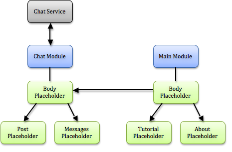

#Service-Module-Placeholder

Catberry proposes to use [Service-Oriented Architecture]
(http://en.wikipedia.org/wiki/Service-Oriented_Architecture) where every module 
can work with set of independent services (or one service) that implement 
some business logic.

So, Catberry Application consist of:

 * Set of services (HTTP servers)
 * Set of modules (more details in [Modules section](modules/index.md))
 * Set of placeholders. Templates that can reference each other 
 (more details in [Placeholders section](modules/placeholders.md))

Typical architecture in common case is presented in image below:

You can find example application [here](../project_template) with architecture 
that is described below:

This approach allows your module to be executed at server and browser as well 
without any additional logic written by you. All you need is to use 
[Universal HTTP(S) Request](services/userland/universal-http-request.md) - 
this component implements HTTP(S) request logic using XmlHttpRequest in browser 
and http.request at server and has the same interface.

Read next:

* [Catberry Services](services/index.md)